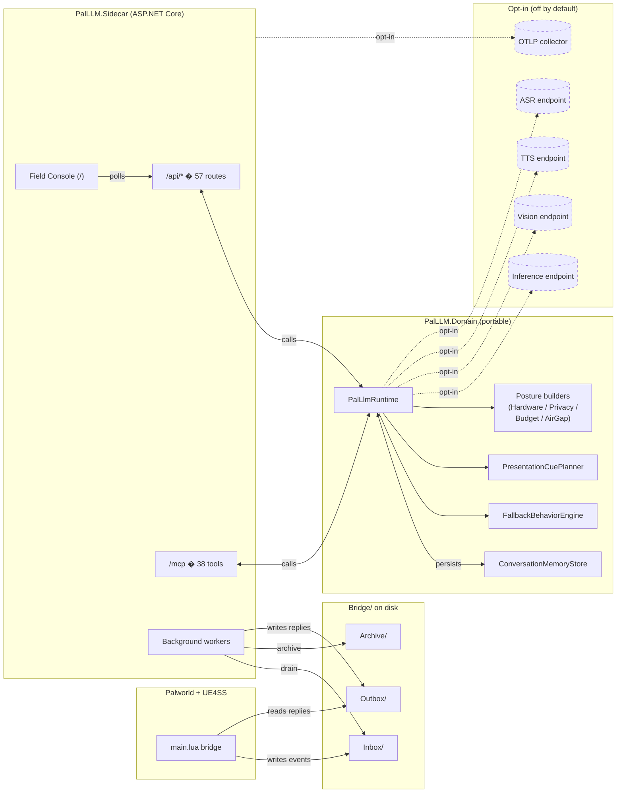

# PalLLM Architecture

Last audited: `2026-05-23`

## Core posture

PalLLM follows a cross-game portable-adapter direction rather than
copying any specific game's implementation details:

- thin game adapter
- portable runtime concepts
- local-first execution
- deterministic fallback before blind dependence on live inference
- explicit bridge layer between Palworld hooks and the model runtime

## Solution layout

Current solution shape:

- `src/PalLLM.Domain` - class library with runtime logic
- `src/PalLLM.Sidecar` - ASP.NET Core minimal-API host
- `tests/PalLLM.Tests` - NUnit test project
- `mod/ue4ss/Mods/PalLLM` - UE4SS Lua bridge
- `scripts/` - install, one-click launch, smoke, doctor, shared tooling, and release packaging

Audit-backed test status:

- `1309` tests passed on `2026-05-23`

HTTP ingress is bounded before and after JSON binding. The sidecar applies
`PalLLM:Http:ApiRequestBodyMaxBytes` (`10 MiB` default) to `/api` and `/mcp`
request bodies, returning sanitized `413 ProblemDetails` before oversized JSON
can allocate through model binding. Hot chat ingress then gets tighter semantic
validation: the sidecar rejects oversized HTTP chat and party-chat text with
`ValidationProblemDetails`, while
`PalLlmRuntime.ChatAsync` trims oversized direct/MCP/internal calls to the same
`ChatRequest.UserMessageMaxLength` (`16 KiB`) before prompt assembly, memory,
inference, outbox, and advisory work. Party chat also caps fan-out at eight
positive character ids because each id runs a full chat turn.

The deterministic advisory/proof POST surfaces use the same boundary filter for
caller text: `/api/chat/plan`, `/api/why`, `/api/directives/plan`,
`/api/duo/plan`, `/api/disagreement/check`, `/api/proof/packet`, and the model
collaboration planner reject over-cap text before tokenization, hashing,
classification, or plan construction. Proof packets also cap caller-supplied
evidence lists at 32 lines so provenance remains a bounded summary.

PalLLM.Domain is self-contained: it owns its portable-adapter surface in
[`src/PalLLM.Domain/Portable/PortableAdapterContracts.cs`](../src/PalLLM.Domain/Portable/PortableAdapterContracts.cs) �
interfaces for the game-agnostic seams (`IGameAdapter`, `ICharacter`,
`IWorldClock`, `IPathProvider`, `ILogger`) plus the deterministic
`SemanticEmbedder` and the reasoning-tag `ResponseCleanup`. No external
project references to any other adapter library � the published binary
is redistributable from this repository alone. See
[`../THIRD_PARTY_NOTICES.md`](../THIRD_PARTY_NOTICES.md) for the
runtime-dependency terms of the NuGet packages PalLLM does pull.

## System at a glance

The runtime splits into four shells: the game (Palworld + UE4SS),
the on-disk bridge directories, the sidecar process, and the
domain library inside it. Optional opt-in dependencies sit
outside; the runtime works fully without them.



How to read it:

- **Solid lines** are always-on local data flows (filesystem and
  in-process calls).
- **Dashed lines** are opt-in network calls; the sidecar emits zero
  outbound traffic on those edges until an operator turns the
  feature on. See [`adr/0006-opt-in-everything-by-default.md`](adr/0006-opt-in-everything-by-default.md).
- The bridge between the game and the sidecar is **filesystem-only**
  and **one-way at any moment** � the sidecar never reaches into
  Palworld's process. See [`adr/0003-one-way-advisory-bridge.md`](adr/0003-one-way-advisory-bridge.md).
- Domain code never references Sidecar or UE4SS code; the seam is
  the portable adapter interfaces. See
  [`adr/0002-portable-adapter-seam.md`](adr/0002-portable-adapter-seam.md).

## Data model

The runtime carries a small set of long-lived objects through every
chat turn. Their relationships look like this:

```mermaid
erDiagram
    PalLlmRuntime ||--|| ConversationMemoryStore : owns
    PalLlmRuntime ||--|| RelationshipTracker     : owns
    PalLlmRuntime ||--|| FallbackBehaviorEngine  : delegates-to
    PalLlmRuntime ||--|| PresentationCuePlanner  : delegates-to
    PalLlmRuntime ||--|| ChatDispatchPlanner     : delegates-to
    PalLlmRuntime ||--o| InferenceClient         : opt-in
    PalLlmRuntime ||--o| HttpVisionClient        : opt-in
    PalLlmRuntime ||--o| HttpTtsClient           : opt-in
    PalLlmRuntime ||--o| AudioTranscriptionClient: opt-in
    PalLlmRuntime ||--|| PromotionLedger         : observes-via
    PalLlmRuntime ||--|| IGameAdapter            : portable-seam

    ConversationMemoryStore ||--o{ MemoryEntry          : holds
    MemoryEntry             }o--|| ICharacter           : addressed-to
    RelationshipTracker     ||--o{ CharacterRelationship: holds
    CharacterRelationship   }o--|| ICharacter           : about

    PromotionLedger          ||--o{ PromotionObservation : holds
    PromotionObservation     }o--|| ProofPacket          : provenance
    ChatResponse             }o--|| ProofPacket          : provenance
    ChatResponse             ||--|| PresentationCuePlan  : carries
    ChatResponse             }o--o| ActionIntent         : may-carry
    ChatResponse             }o--o| SpeechArtifact       : may-carry

    OutboxEnvelope           ||--|| ChatResponse         : wraps
    BridgeEventEnvelope      }o--|| ICharacter           : may-address

    IGameAdapter ||--|| ICharacter   : exposes
    IGameAdapter ||--|| IWorldClock  : exposes
    IGameAdapter ||--|| IPathProvider: exposes
    IGameAdapter ||--|| ILogger      : exposes
```



The portable seam (`IGameAdapter` and its four sub-interfaces) is
the single contract a downstream harvester implements to lift the
runtime into another game. See
[`adr/0002-portable-adapter-seam.md`](adr/0002-portable-adapter-seam.md).

The `ProofPacket` (SHA-256 id + decision + evidence + provenance)
travels alongside every automated change for audit purposes �
whether that's a `ChatResponse` (the chat turn's reasoning trail)
or a `PromotionObservation` (the promotion-loop's evidence).

## Current components

### PalLLM.Domain

This project owns the parts that should survive even if the Palworld hook
surface changes:

- `BridgeGameAdapter` implementing the portable-adapter seam defined in `Portable/PortableAdapterContracts.cs`
- `ConversationMemoryStore` using deterministic embeddings plus exact-token
  reranking for recall, pooled snapshots on scored recall, reverse-scan read
  paths for recent-memory and importance windows, and a `4 KiB` per-entry
  content cap so the hot memory path stays low-allocation and chat responses
  cannot echo oversized historical snippets
- `MemoryImportance` deriving deterministic salience scores for remembered
  entries
- `ReflectionService` consolidating salient recent entries into reflection
  memories when enabled
- `RelationshipTracker` maintaining per-character affinity, mood, and tone
- `NarrativePackService` and `NarrativePackValidator` for authored pack loading
  and validation, with lazy recursive pack discovery and bounded
  `1,000,000`-byte per-file JSON reads on startup/reload so one oversized or
  malformed pack cannot derail the whole pass, plus deterministic
  publication-safety checks that reject obvious official-endorsement claims,
  unrelated third-party IP references, model/runtime/vendor brand references,
  broad multi-game platform language, and legal/IP/compliance overclaims before
  shareable text reaches public surfaces
- `PersonalityPackValidator` for local personality packs, with bounded
  `pack.json`, prompt, optional voice-reference, and optional audio-sample
  assets before any pack text, voice metadata, or hash-covered file can become
  a runtime input
- `PalTaskRouter` classifying requests into runtime-oriented task kinds
- `FallbackBehaviorEngine` with `19` deterministic strategies
- `PresentationCuePlanner` producing paired visual and audio cue plans
- source-generated `System.Text.Json` metadata on bridge inbox/outbox,
  session, lifetime relationship, promotion proof, pack-manifest, vision
  parsing, and opt-in inference/vision/TTS/ASR request-body paths so repeated
  JSON reads/writes avoid reflection-heavy contract discovery
- `HttpJsonInferenceClient` with streamed success-path parsing,
  retry, configurable request shaping, and a three-state circuit breaker
- `ModelCollaborationPlanner` translating configured model lanes into
  explicit scout/worker/judge recipes plus hardware-aware self-healing loops
  and per-lane capability profiles (modalities, serving backend, structured
  output/tool-call/speculative-decoding fit, precise n-gram / draft /
  model-native MTP speculation profile, machine-readable serving profile,
  promotion receipts, metric receipts,
  deterministic prefix-cache hashing, optional cache-salt isolation,
  vLLM low-latency `--performance-mode interactivity` proof guidance,
  optional vLLM request-priority scheduling proof,
  disaggregated prefill/decode P/D topology proof for vLLM tail-latency
  experiments, including MoRIIO single-node read/write proof,
  sparse-MoE DBO proof-lane receipts for multi-GPU data/expert-parallel worker
  servers,
  Mooncake Store distributed KV-cache proof for vLLM offload or multi-instance
  prefix-reuse experiments,
  PegaFlow-style and FlexKV external KV cache process-boundary proof for
  worker-restart and cache-daemon rollback experiments,
  Qwen3.6 MTP-1 prefix-cache-off latency proof guidance,
  Qwen3.6 hybrid-GDN state receipts,
  proof-gated KV-cache dtype compression, route-labeled replay receipts,
  cache-aware routing proof,
  vLLM KV-block residency sampling proof,
  vLLM KV-event redaction proof for block-store/remove evidence,
  SGLang radix-cache / HiCache hierarchical KV / deterministic-proof /
  metrics / local replay hints plus support-matrix-gated attention-backend,
  FP4/FP8 KV, EAGLE-3/adaptive, and SpecV2 proof receipts,
  TensorRT-LLM `/v1` health, metrics, KV-cache, speculation, and multimodal
  proof hints, transformers serve continuous-batching, `/load_model`,
  `/v1/responses` proof-lane, revision-pinning, ASR, primary-source
  capability receipts, model-artifact provenance receipts (license, lineage,
  immutable revision/hash, weight
  format, runtime/tokenizer revision, `trust_remote_code`, and redistribution
  decision),
  LM Studio `lms` / `/v1` / TTL proof, OpenVINO Model Server `/v3` target-device proof, Foundry Local /
  Windows ML dynamic-endpoint and execution-provider proof, Gemma 3n /
  Gemma 4 audio proof with family-specific token budgets, Qwen Omni
  audio-output plus `/v1/video/chat/stream` streaming-video proof and
  `/v1/videos` offline diffusion-job proof, and tool-call qualification hints,
  schema-digest/request-shape structured-output receipts, media-cache hints,
  idle VRAM reclaim guardrails,
  local hash-pinned LoRA/personality-adapter guardrails, admission controls,
  promotion receipts, metric receipts, promotion verification checks, and
  runtime guards)
- `HardwareProfiler` deriving the coarse tier and quantization hint from
  OS-backed CPU/RAM signals, bounded Linux `/proc` GPU/memory probes, Windows
  physical-memory APIs, and sanitized Windows display-adapter registry strings
  without launching vendor tools
- `InferenceExecutionPlanner` translating the active lane plus task profile
  into live `/api/chat` execution profiles (`fast-reactive`,
  `fast-interactive`, `fast-deliberate`, `fast-creative`,
  `dense-interactive`, `dense-deliberate`, `dense-creative`) so
  temperature, token budget, thinking mode, live-vision use, and prompt
  evidence budgets are decided per turn instead of once globally
- `HttpVisionClient` and `VisionOrchestrator` for streamed image describe,
  world-state extraction, and chat visual augmentation. Caller-supplied image
  base64 is inspected for shape and decoded-size before any data URL is built
  or model-server request is sent
- inference and vision oversized success-body failures map through one explicit
  local status contract (`"... response exceeds the configured cap of N
  bytes."`) instead of depending on exception-message text from the bounded
  transport helper
- `HttpTtsClient` for timeout-capped synthesis calls plus bounded binary
  response reads before audio is materialized, written, or attached to a
  response. The default request body stays `{ text, voice }`, and
  `Tts.RequestFormat=openai_speech` switches to the current
  OpenAI-compatible `/v1/audio/speech` body (`input`, `voice`, optional
  `model`, `response_format`) for vLLM-Omni/Qwen3-TTS-style lanes. Concrete
  upstream audio `Content-Type` wins; missing or generic binary content types
  fall back to the requested `Tts.ResponseFormat`, including `.pcm` +
  `PlaybackHint=raw_pcm` for raw-audio canaries. The C# runtime and UE4SS Lua
  bridge now agree on the compressed `media_player` containers (`mp3`, `m4a`,
  `aac`, `wma`, `ogg`, `opus`, `flac`) before a local helper attempt is
  reported through `speech_playback`. Raw PCM is recognized by the bridge but
  remains proof-only: it emits a `raw_pcm` receipt with byte count, zero launch
  attempts, elapsed milliseconds, `FailureCode=raw_pcm_native_mixer_required`,
  and a native-mixer blocker reason instead of launching a desktop helper.
  `/api/bridge/proof` now splits this into a dedicated `native_audio_mixer`
  lane so raw PCM promotion requires an explicit native mixer receipt rather
  than inference from a skipped helper playback attempt. The actual callback
  seam is default-off in `config/native-hud.lua`: when
  `native_audio_mixer_enabled=true`, the bridge calls
  `native_audio_mixer_callback_name` and reports unavailable, failed, rejected,
  or started native-mixer receipts with stable failure codes.
  Parameterized raw audio MIME values such as
  `audio/L16; rate=24000; channels=1` now contribute content-free timing
  metadata to the same receipt, and incomplete raw sample frames report
  `FailureCode=raw_pcm_block_alignment_invalid`.
  WAV helper receipts also carry content-free RIFF metadata
  (`AudioEncoding`, `SampleRateHz`, `ChannelCount`, `BitsPerSample`,
  `DurationMs`, `ByteRate`, `BlockAlignBytes`, `AudioDataBytes`,
  `FrameCount`, `BlockRemainderBytes`, `ValidBitsPerSample`, `ChannelMask`,
  `SampleFormat`, `ByteOrder`, `MixerConversionHint`, `MixerQuantumMs`,
  `MixerQuantumFrames`, `MixerQueueDepthEstimate`, `MixerTailFrames`,
  `MixerBufferedMs`, `MixerTailMs`, `PlaybackSequence`,
  `SupersededRequestId`, `SupersededSpeechCount`, `SupersededSpeechAgeMs`,
  `SupersededSpeechBufferedMs`, `SupersededSpeechRemainingMs`, and
  `CancellationMode`) so
  the future native mixer can be qualified against concrete layout, sample
  interpretation, conversion work, low-latency queue depth, buffer duration, and
  buffer-lifetime plus stale-speech supersession evidence. Unsupported WAV
  encodings and data chunks that are not aligned to the declared block size are
  rejected before a helper launch can be reported as started.
  The bridge-loop proof also derives `SpeechPlaybackIngressLagMs`,
  `SpeechPlaybackOutboxLagMs`, and `SpeechPlaybackDeliveryLagMs` from existing
  event timestamps, giving operators content-free request-to-speech,
  outbox-to-speech, and visible-delivery-to-speech lag evidence without adding
  new audio data to the bridge event.
- `AudioTranscriptionClient` for default-off OpenAI-compatible ASR calls.
  `POST /api/audio/transcribe` validates base64 audio and MIME type before
  posting multipart `file` data to `PalLLM:Asr:BaseUrl`; upstream JSON and
  transcripts are bounded by `Asr.MaxResponseBytes` and
  `Asr.MaxTranscriptCharacters`. Optional `Endpointing` metadata is kept local
  as a content-free VAD / turn-close proof receipt against
  `Asr.PreSpeechPaddingMs`, `Asr.EndpointSilenceMs`, and
  `Asr.MaxTurnDurationMs`; `Asr.ResponseFormat=verbose_json` can optionally
  send allowlisted `Asr.TimestampGranularities[]` values (`segment`, `word`)
  and reduce returned verbose timing metadata to content-free counts,
  duration/coverage fields, and review flags. `Asr.ChunkingStrategy=auto` can
  also forward OpenAI-compatible server/VAD file-chunking after endpoint proof,
  while the default stays field-free for strict local ASR servers. The same verbose segment array
  now yields content-free quality receipts for `avg_logprob`,
  `compression_ratio`, `no_speech_prob`, and segment temperature so noisy or
  hallucinated speech turns can be reviewed without preserving segment text,
  token ids, audio, or raw verbose JSON. Sanitized upstream request-id and
  processing/phase-timing header receipts flow through the response, health
  counters, metrics, and proof bundles without storing upstream logs,
  segment/word text, raw audio, or transcript content; disabled/upstream
  failures return sanitized status text
- `ChatRateLimiter` for per-character sliding-window protection
- `ActionIntentPlanner` for advisory, allowlisted action suggestions
- `SessionPersistence` for save/load/autosave of memory and relationships,
  with bounded `session.json` ingress plus `.bak` fallback on malformed,
  oversized, or unreadable primary files
- `DirectoryRetention` for bounded outbox, archive, failed, diagnostics, TTS,
  and pending screenshot directories, using lazy file enumeration plus a
  bounded newest-file priority queue so long sessions do not materialize and
  sort an entire bridge directory just to prune it
- `PalLlmRuntime` orchestrating snapshot updates, bounded bridge-drain
  ingress, prompt construction, inference, fallback, memory, relationships,
  vision, outbox writes, and session persistence

### Sidecar host

`src/PalLLM.Sidecar` is a local ASP.NET Core host. The root URL serves the
static `PalLLM Field Console` UI from `wwwroot/`, while machine-facing JSON
lives under `/api`.

The sidecar enables:

- `ProblemDetails` with request trace IDs
- response compression for JSON and standard text responses
- source-generated `System.Text.Json` metadata on the hot HTTP, health-probe,
  ETag, and MCP payload paths to reduce startup work and repeated allocation
  pressure on the local sidecar
- browser-origin validation on `/mcp`: requests without `Origin` still work,
  loopback browser origins are allowed automatically, and non-loopback browser
  origins must be explicitly allowlisted via `PalLLM:Auth:McpAllowedOrigins[]`
- conditional private-cache + `ETag` revalidation on `/api/dashboard`,
  `/api/features`, `/api/describe`, `/api/bridge/proof`,
  `/api/release/readiness`, and `/api/mcp/upstream`, while the rest of the API
  plus `/metrics` and `/health/*` stay `no-store`
- baseline browser security headers on the dashboard and JSON surfaces
  (`Content-Security-Policy`, `Permissions-Policy`, `Referrer-Policy`,
  `X-Content-Type-Options`, `X-Frame-Options`)
- static-file hosting for the dashboard UI
- liveness and readiness health checks

#### HTTP surface

Static and operational routes:

- `GET /` - `PalLLM Field Console`
- `GET /metrics`
- `GET /health/live`
- `GET /health/ready`
- `GET /openapi/v1.json` - OpenAPI 3.1 document generated from the live route registrations
- `GET /openapi/v1.yaml` - YAML variant of the same generated OpenAPI document
- committed build-time snapshot at `docs/openapi/palllm-sidecar-v1.json`, with
  drift verified by `powershell -NoProfile -ExecutionPolicy Bypass -File scripts/export-openapi.ps1 -Verify` in CI and the local
  full-audit pipeline

/api routes (57 total):

- `GET /api/health`
- `GET /api/dashboard`
- `GET /api/features`
- `GET /api/describe`
- `GET /api/quickstart`
- `GET /api/airgap/verify`
- `GET /api/self-healing/status`
- `GET /api/roles`
- `GET /api/hardware`
- `GET /api/privacy/posture`
- `GET /api/degradation/advisory`
- `GET /api/budgets`
- `GET /api/narration/cue`
- `POST /api/directives/plan`
- `POST /api/chat/party`
- `GET /api/promotion/summary`
- `GET /api/promotion/suggestions`
- `POST /api/promotion/apply/preview`
- `POST /api/promotion/apply`
- `POST /api/duo/plan`
- `POST /api/disagreement/check`
- `POST /api/proof/packet`
- `POST /api/promotion/record`
- `POST /api/why`
- `POST /api/chat/stream`
- `POST /api/chat/plan`
- `GET /api/bridge/proof`
- `GET /api/release/readiness`
- `GET /api/inference/performance`
- `GET /api/inference/collaboration`
- `POST /api/inference/collaboration/plan`
- `POST /api/inference/warmup`
- `GET /api/mcp/upstream`
- `GET /api/packs`
- `GET /api/logs`
- `GET /api/world`
- `GET /api/relationships`
- `GET /api/relationships/{characterId}`
- `GET /api/relationships/lifetime`
- `GET /api/characters/{characterId}/mood`
- `GET /api/bridge/outbox`
- `GET /api/bridge/ui-probe`
- `POST /api/packs/reload`
- `POST /api/packs/validate`
- `POST /api/snapshot`
- `POST /api/bridge/drain`
- `POST /api/bridge/outbox/clear`
- `POST /api/chat`
- `POST /api/memory/recall`
- `POST /api/vision/describe`
- `POST /api/vision/world-state`
- `POST /api/vision/screenshots/process`
- `POST /api/session/save`
- `POST /api/session/reload`
- `POST /api/audio/transcribe`
- `POST /api/tts/synthesize`

Notable endpoint behavior:

- `GET /api/dashboard` returns a `DashboardSnapshot` aggregate and appends a
  `Server-Timing` header, `ETag`, and
  `Cache-Control: private, no-cache, must-revalidate` so the browser dashboard
  can revalidate cheaply.
- `GET /api/features` returns a fingerprinted feature catalog with `ETag` plus
  a longer private cache TTL (`60` minutes by default).
- `GET /api/describe` returns the AI/MCP self-description manifest with `ETag`
  plus its own short private cache TTL (`15` seconds by default) so reconnects
  avoid repeated manifest rebuilds without pinning stale operator posture for
  long.
- `GET /api/bridge/proof` returns the machine-readable Palworld-native proof
  state with `ETag` plus the same private cache TTL used by the feature
  catalog/readiness snapshot, including the current HUD-bind recommendation
  shortlist, the bridge-reported configured HUD target list, and a normalized
  `ProofLanes[]` checklist for bridge boot, `UserWidget` compatibility,
  `ui_probe` capture, native HUD bind, chat ingress, outbox reply, visible
  delivery, optional speech playback, raw PCM native-audio-mixer readiness,
  and guarded-action feedback.
- `GET /api/release/readiness` returns the automation-facing release surface
  snapshot with `ETag` plus the same private cache TTL used by the feature
  catalog. It now includes a durable `SmokeEvidence` summary sourced from
  `Runtime/ReleaseEvidence/latest-smoke.json`, a live
  `NativeProofEvidence` summary sourced from
  `Runtime/ReleaseEvidence/latest-native-proof.json`, and a packaged
  `ProofBundleEvidence` summary sourced from
  `Runtime/ReleaseEvidence/latest-proof-bundle.json` plus the sibling zip, as
  well as `SupportBundleEvidence` sourced from
  `Runtime/SupportEvidence/latest-support-bundle.json` plus the sibling zip,
  `PackageVerificationEvidence` sourced from
  `Runtime/ReleaseEvidence/latest-package-verification.json`, and
  `ArtifactIntegrityEvidence` sourced from
  `Runtime/ReleaseEvidence/latest-artifact-integrity.json`, and
  `FullAuditEvidence` sourced from
  `Runtime/ReleaseEvidence/latest-full-audit.json`. The seven evidence
  summaries also classify freshness so stale proof is visible without diffing
  timestamps by hand. Native proof evidence is corroborated before promotion:
  a readable artifact that claims `proven` is downgraded to `invalid` unless it
  also carries `BridgeProofStatus = "delivery_proven"`,
  `LiveDeliveryProven = true`, and `NativeHudBindReady = true`.
- `GET /api/inference/performance` returns a bounded `15` minute
  `InferencePerformanceSnapshot` grouped by provider/model lane, with
  success/failure counts, average latency, p95 latency, latest and aggregate
  token totals, the latest error marker, the latest upstream HTTP request id,
  upstream processing and queue/TTFT/prefill/decode phase-timing receipts,
  the latest upstream completion id and `system_fingerprint` when exposed,
  latest `finish_reason` receipts, detailed usage receipts for cached prompt
  tokens, audio tokens, reasoning tokens, and predicted-output token matches
  when exposed, and a first-class recent-window readiness assessment.
  It emits a strong `ETag` and uses `Cache-Control: private, no-cache,
  must-revalidate` so operator dashboards can always revalidate the current
  lane posture cheaply without serving a stale cached window.
- `GET /api/mcp/upstream` returns ordered upstream discovery snapshots with
  `ETag` plus a short private cache TTL (`5` seconds by default); failure
  entries expose stable `ErrorCode` values plus sanitized `Error` messages,
  and each upstream's tool/resource/prompt arrays are bounded by
  `PalLLM:McpClient` caps before they ever hit the cache or response body.
- `POST /api/snapshot` is tolerant of partial bridge payloads: `null`
  collections and nested character payloads are normalized to empty
  collections / zeroed position objects at the domain boundary so a lean
  Palworld bridge post or smoke helper cannot crash the sidecar.
- `POST /api/inference/warmup` primes the currently active model with a tiny
  low-token request so the first real turn does not pay the full load penalty,
  and can route that warmup through provider-specific residency controls when
  the active endpoint supports them.
- `POST /api/chat` validates input and returns a `ChatResponse` that can include
  lane-specific inference metadata (`InferenceModel`, `InferenceProfileId`,
  `InferenceLane`, `ThinkingRequested`, `VisualContextSource`), fallback
  metadata, presentation cues, an advisory action intent, and an optional
  disk-backed `Speech` artifact. The response path is bounded before fan-out:
  system prompts cap at `16,000` characters, live assistant text caps at
  `8 KiB`, and stored memory entries cap at `4 KiB`.
- `POST /api/vision/world-state` can merge extracted fields into the live
  snapshot when `ApplyToSnapshot=true`.
- `POST /api/audio/transcribe` returns a structured transcription result even
  when ASR is disabled, so callers do not need exception-driven control flow.
- `POST /api/tts/synthesize` returns a structured synthesis result even when TTS
  is disabled, so callers do not need exception-driven control flow.
- background workers process bounded chunks per poll so large filesystem backlogs
  do not monopolize a single loop.

#### Background workers

Six hosted services run alongside the HTTP layer:

- `BridgeInboxWorker` drains `%LOCALAPPDATA%\Pal\Saved\PalLLM\Bridge\Inbox`
  on the configured bridge interval
- `InferenceWarmupWorker` primes the active inference lane on startup and can
  optionally keep it resident on a configured keep-alive cadence, while
  suppressing periodic keepalive POSTs when recent live chat traffic already
  kept the same model warm; Ollama-compatible lanes can use native
  `/api/chat` preloads with `keep_alive`, while LM Studio-compatible lanes can
  apply `ttl` on chat-completions requests
- `ScreenshotWatcher` polls `Bridge/Screenshots`, reads each image through a
  bounded pooled base64 reader (`ArrayPool<byte>` + `FileOptions.SequentialScan`),
  and feeds the result through the structured vision world-state extractor when
  enabled
- `SessionAutosaveWorker` writes `runtime-root/session.json` on the configured
  autosave cadence and again on shutdown; load paths cap the file with
  `PalLLM:Session:MaxPersistedBytes` before deserialization so startup stays
  bounded even if the persisted file is corrupted or unexpectedly large
- `ModelTierUpgradeWorker` probes configured inference model tiers and promotes
  the live route to the highest currently-available tier, then triggers a
  bounded warmup on tier changes
- `McpUpstreamDiscoveryWorker` refreshes configured upstream MCP discovery
  snapshots on the configured discovery interval through a named pooled
  `HttpClient`

The repo also now ships a manual sidecar smoke helper at
`scripts/run-sidecar-smoke.ps1`. It discovers `RuntimeRoot` via `/api/health`,
seeds a minimal snapshot and bridge event, calls `/api/chat`, confirms a
matching `chat_reply` envelope lands in `Bridge/Outbox`, injects synthetic
`reply_delivery` plus matching action feedback when applicable, and requires
`RuntimeHealth.BridgeLoop.LoopClosed` before the script passes. A successful
run also persists `Runtime/ReleaseEvidence/latest-smoke.json` plus a timestamped
history artifact under `Runtime/ReleaseEvidence/History`.

For live Palworld-native proof, `scripts/run-native-proof.ps1` polls
`/api/bridge/proof` until the bridge reaches `delivery_proven`, can optionally
apply the current HUD recommendation through
`scripts/apply-hud-bind-recommendation.ps1`, and persists
`Runtime/ReleaseEvidence/latest-native-proof.json` plus a timestamped history
artifact. The artifact now carries watcher start/finish timestamps, timeout and
poll cadence, poll count, a completion reason, stable diagnosis
code/summary/action/command fields, and a bounded status-transition trail so
failed live runs can be replayed and routed without scraping console output.
That keeps synthetic smoke and real in-game delivery proof separate.

To package that evidence cleanly, `scripts/export-release-proof-bundle.ps1`
captures `/api/release/readiness`, `/api/bridge/proof`,
`/api/inference/performance`, and `/api/health`, copies the latest
smoke/native-proof artifacts plus the active HUD config when available, and
writes `Runtime/ReleaseEvidence/latest-proof-bundle.json` plus
`Runtime/ReleaseEvidence/latest-proof-bundle.zip`. The manifest records compact
inference status/lane/latest-receipt/token-receipt counts while the full
snapshot travels as `inference-performance.json` inside the zip. Before the
manifest is written, the staged portable text files pass through the shared
privacy redaction pass and then the shared publication text-surface scanner; the
manifest records `PrivacyRedaction*` fields plus `PublicationScanPassed`,
checked file count, and violations. The bundle becomes `invalid` when the scan
finds sibling-project bleed, endorsement/approval claims, unrelated franchise
references, broad platform-scope drift, or legal certainty overclaims. The
stricter root-package pass also keeps player-facing root copy free of
third-party model/runtime/vendor brands. Old bundles without redaction evidence
are routed toward recapture before sharing.

`/api/release/readiness` keeps its prose `Publication.NextRecommendedPass` for
humans and also emits `Publication.NextRecommendedCommand` for automation. The
command field names the exact next local script when the remaining hardening
step is scriptable; it stays blank only when the next step is manual clean
machine or live in-game validation.

For the candidate zip itself, `scripts/verify-release-package.ps1` expands a
release zip (or walks an already-expanded package directory), validates it
against the embedded `RELEASE_PACKAGE_MANIFEST.json`, and persists
`Runtime/ReleaseEvidence/latest-package-verification.json`. That keeps
"runtime proof exists" separate from "the actual release package is
structurally correct."

For local artifact integrity, `scripts/compute-release-checksums.ps1` computes
`SHA256SUMS`, `SHA512SUMS`, and `checksums.json` under `artifacts/packaging/`,
then persists `Runtime/ReleaseEvidence/latest-artifact-integrity.json`. The
readiness reader treats missing or dangling digest files as `invalid`, reports
whether detached signature files were present beside the manifests, and keeps
checksum evidence separate from package-structure verification and live
Palworld proof.

When `/api/release/readiness` reads the latest proof/support bundle manifests,
it also inspects the paired zip archives without extracting them. The archive
must be readable, contain its own bundle manifest, carry every manifest-listed
included file, avoid duplicate normalized file entries, and use only relative
path-safe entry names. The archived manifest must also match the
sidecar-readable manifest's promotion-relevant status fields, native-HUD config
fields, optional-file list, blockers, and ready-evidence receipts. Otherwise
the evidence block is downgraded to `invalid` even if the latest JSON file
still exists. This keeps stale, mismatched, or path-confused handoff archives
from being mistaken for publication-ready proof.

### Operational scripts

The repo now includes a shared PowerShell tooling layer plus first-pass
player/operator scripts:

- `scripts/PalLLM.Tooling.ps1` centralizes repo-root, runtime-root, Steam
  library, and Palworld install detection
- `scripts/install-mod.ps1` installs the mod into a detected or explicit
  Palworld root using copy or junction mode
- `scripts/install-dev-mod.ps1` preserves the dev junction workflow while
  routing through the shared installer
- `scripts/doctor.ps1` validates the mod install, runtime directories, sidecar
  health, dashboard availability, and now separately reports Palworld-native
  readiness (bridge boot, HUD seam, production sampler, waypoint marker, action
  executor gate) plus reply-delivery proof and the status of the latest
  persisted native-proof artifact, so "HTTP is healthy" is not confused with
  "the real game-side seams are proven"
- `scripts/run-native-proof.ps1` watches the live Palworld bridge until native
  HUD delivery is actually proven and writes the resulting artifact into the
  release-evidence directory. The watcher and read-only `pal proof` command now
  consume the same `/api/bridge/proof` proof-lane contract that dashboards and
  release tooling can harvest.
- `scripts/export-release-proof-bundle.ps1` archives the current release,
  bridge, inference-performance, smoke, native-proof, and HUD-config evidence
  into a single durable proof bundle for release validation, including portable
  privacy-redaction and publication-scan results plus compact response,
  finish-reason, token, TTS/ASR success-evidence counts, ASR endpointing
  receipt counts, and content-free ASR confidence receipt counts
- `scripts/start-sidecar.ps1` launches either the packaged published sidecar or
  the repo project from one entry point, now with a first-class self-contained
  sidecar exe fallback before the packaged DLL path
- `scripts/play-palllm.ps1` plus the package-root `play.bat` provide the
  primary player-facing launch flow for release builds and now persist a
  latest-launch snapshot under `Runtime/LaunchEvidence` for support/debugging
- `scripts/export-support-bundle.ps1` plus the package-root `support.bat`
  gather the latest launch/proof/readiness snapshots into one portable support
  archive under `Runtime/SupportEvidence`, with the same publication-scan
  fields and privacy-redaction evidence as proof bundles
- `scripts/package-release.ps1` builds a release zip that preserves the layout
  expected by `install-mod.ps1`, writes `RELEASE_PACKAGE_MANIFEST.json`, and
  can optionally include a published sidecar
- `scripts/verify-release-package.ps1` validates a candidate release zip or
  expanded release directory against the embedded manifest and persists a
  durable package-verification artifact for release-readiness; it reuses the
  same scanner while also enforcing root player-copy provider neutrality

### Field Console UI

The root UI lives in `src/PalLLM.Sidecar/wwwroot/` and is a static dashboard
focused on operational truth rather than control surfaces.

The current interface exposes:

- runtime overview metrics
- recent inference-lane summaries
- world-state summary
- bridge activity summary plus ranked `ui_probe` candidate hints
- outbox listings
- recent log entries
- tracked relationships
- lazy-loaded feature inventory

The UI is intentionally read-heavy and keeps the first paint focused on live
session state instead of loading the feature catalog up front.

### Configuration model

Options bind from the `PalLLM` section of `appsettings.json` into
`PalLlmOptions`. The sidecar project enables .NET's configuration binding
source generator, so this large startup-only options tree binds without the
reflection-heavy binder path. Runtime semantics are unchanged: the same
`PalLlmOptionsValidator` still fail-fast validates the bound tree before
HTTP routes and background workers serve traffic.

The current nested option blocks are:

- `Bridge`
- `Inference`
- `Fallback`
- `Vision`
- `Session`
- `Tts`
- `Asr`
- `Automation`
- `Http`
- `McpClient`
- `Auth`

Current shipped defaults in `appsettings.json`:

- inference disabled
- fallback enabled
- vision disabled
- session enabled with autosave
- TTS disabled
- ASR disabled
- automation disabled
- bridge outbox enabled
- feature-catalog private caching enabled (`60` minutes)
- upstream-MCP snapshot private caching enabled (`5` seconds)
- heavy HTTP lanes use bounded concurrency/queues plus endpoint request
  timeouts: chat, chat streaming, and manual inference warmup (`130` seconds), vision and
  screenshot processing (`45` seconds), and speech/audio endpoints (`45`
  seconds). Admission
  pressure returns `429 ProblemDetails`; accepted one-shot work that exceeds
  the lane timeout returns sanitized `503 ProblemDetails`; chat streaming
  reports the same budget as a sanitized SSE `error` event after headers flush.
- successful inference and vision JSON bodies capped at `65536` bytes each
- successful TTS audio bodies capped at `16777216` bytes
- ASR uploads capped at `4194304` decoded bytes, ASR JSON responses capped at
  `65536` bytes, ASR transcripts capped at `8192` characters, and optional
  ASR endpointing receipts graded against 300 ms pre-speech padding, 500 ms
  trailing silence, and 30000 ms max turn defaults
- ASR confidence receipts disabled by default; when `RequestLogprobs=true`,
  compatible transcription endpoints receive `include[]=logprobs` and PalLLM
  reduces returned token logprobs to count/min/average/review fields without
  storing token text
- inference residency auto-detection enabled with a `1800` second TTL budget
  for compatible local runtimes
- inference prefix-cache salt forwarding disabled by default; when configured,
  it is emitted as vLLM-compatible `cache_salt` on chat-completions requests
- inference request-priority forwarding disabled by default; when configured,
  it is emitted as vLLM-compatible `priority` on chat-completions requests
- inference parallel-tool-call forwarding disabled by default; when configured,
  it is emitted as OpenAI-compatible `parallel_tool_calls` on
  chat-completions requests for strict action/directive canaries
- model-collaboration serving profiles may name optional `--kv-cache-dtype fp8`
  or hardware/server-qualified `nvfp4` experiments, but PalLLM does not change
  upstream KV-cache dtype by default and promotion requires replay proof against
  the same lane using `auto` KV cache
- model-collaboration serving profiles may name vLLM
  `--performance-mode interactivity` for player-facing low-latency companion,
  vision, or narration endpoints, but PalLLM treats it as a measured serving
  mode and asks operators to compare p50/p95 latency, TTFT, ITL, queue behavior,
  and fallback activation against `balanced` / `throughput` before changing
  shared server defaults
- model-collaboration serving profiles may name vLLM
  `--scheduling-policy priority` plus `PalLLM:Inference:RequestPriority` for
  foreground companion lanes, but promotion requires mixed short-turn /
  long-proof replay, confirmation that lower values win queue time, and proof
  that background proof/docs lanes are not starved
- model-collaboration serving profiles may name vLLM sparse-MoE DBO
  (`--enable-dbo` plus decode/prefill token thresholds) for multi-GPU
  data/expert-parallel worker servers, but PalLLM keeps it proof-only until
  route-labeled receipts beat the no-DBO baseline without worse queue pressure,
  parser stability, or fallback activation on mixed short-turn / long-proof
  replay
- model-collaboration serving profiles may name
  `PalLLM:Inference:ParallelToolCalls=false` for strict future
  action/directive lanes, but promotion requires an exact route canary proving
  zero-or-one tool calls and valid arguments before any fan-out contract is
  trusted
- model-collaboration serving profiles may name prompt-level
  `InferencePrompt.Tools` and `InferencePrompt.ToolChoice` for strict
  action/directive canaries. PalLLM forwards `tools` / `tool_choice` only for
  that call, preserves returned `tool_calls` receipts, and keeps ordinary
  companion chat field-free until a route owns the receipt handling and
  fallback behavior.
- model-collaboration serving profiles may name
  `PalLLM:Inference:StopSequences[]` for endpoint-proven delimiter lanes, but
  promotion requires replay evidence that the exact stop delimiters end output
  cleanly without clipping useful companion text
- prompt-level `InferencePrompt.ResponseFormat` forwarding is available for
  route-specific structured-output text canaries, but ordinary companion chat
  omits `response_format` by default and promotion requires accepted request
  shape, schema name/digest, served model id, grammar/backend id, app-side
  schema validation, parse stability, latency, token, and fallback evidence
- prompt-level `InferencePrompt.Prediction` forwarding is available for
  route-specific predicted-output proof/docs canaries, but ordinary companion
  chat omits `prediction` by default and promotion requires accepted request
  shape, accepted/rejected prediction-token receipts when exposed, latency,
  and fallback evidence
- prompt-level `InferencePrompt.Logprobs` / `TopLogprobs` forwarding is
  available for route-specific confidence/evaluator canaries, but ordinary
  companion chat omits `logprobs` / `top_logprobs` by default and promotion
  requires accepted request shape, returned choice-level logprob receipts,
  response-size, latency, and fallback evidence
- prompt-level `InferencePrompt.Modalities` / `Audio` forwarding is available
  for isolated audio-output canaries, but ordinary companion chat omits
  `modalities` / `audio` by default and promotion requires accepted request
  shape, returned `message.audio` receipts on `InferenceResult.AudioJson`, a
  usable text mirror, response-size, latency, and fallback evidence
- prompt-level `InferencePrompt.UserContent` forwarding is available for
  route-specific multimodal input canaries, but ordinary companion chat keeps
  the user message as a plain string. Promotion requires accepted
  text/image/video/audio content-part shapes, media byte caps, parse stability,
  latency, and fallback evidence before a multimodal lane is trusted.
- inference token-budget field selection defaults to `max_tokens` for broad
  local-runtime compatibility; `PalLLM:Inference:TokenBudgetField` can opt into
  `max_completion_tokens` only after the exact endpoint proves it accepts the
  newer reasoning-model budget field without latency, usage, or fallback
  regression
- inference frequency-penalty forwarding is disabled by default; when
  configured, it is emitted as OpenAI-compatible `frequency_penalty` only after
  endpoint proof shows lower repetition without worse latency, token count, or
  fallback pressure
- local sampler forwarding is disabled by default; when configured,
  `PalLLM:Inference:TopK`, `MinP`, and `RepetitionPenalty` are emitted as
  `top_k`, `min_p`, and `repetition_penalty` only after a local runtime proves
  the exact request shape and shows style or repetition improvement without
  parser, p95 latency, token, or fallback regression
- model-collaboration serving profiles now emit `MetricReceipts[]` so operator
  tools know which PalLLM and upstream evidence to capture: PalLLM
  `palllm_chat_duration_seconds` / recent-window status / fallback counters,
  vLLM request, KV-cache, prefix-cache, latency, sleep-state, and multimodal
  cache metrics, SGLang cache/queue/latency metrics, and equivalent local
  receipts for GGUF, Ollama, LM Studio, TensorRT-LLM, OpenVINO, Foundry Local,
  and transformers serve lanes. The profile also asks for separate replay
  receipts by route class (companion chat, vision describe, world-state,
  screenshot proof loops, audio/ASR, and long proof/docs traffic) before cache,
  scheduler, speculation, or routing changes become trusted player defaults.
  vLLM `--kv-cache-metrics-sample` stays a qualification-only way to capture
  KV-block residency, idle-before-evict, and reuse-gap evidence; SGLang
  request dump/replay or crash-dump replay receipts stay local, with only
  sanitized replay templates or hashes allowed in support/public bundles.
- model-collaboration serving profiles now keep SGLang HiCache behind explicit
  proof. `--enable-hierarchical-cache`, host-memory cache, optional storage
  backends, runtime attach/detach, and PD-disaggregation cache transfer can be
  explored for long proof/docs or multi-turn prefix reuse, but promotion needs
  radix-only versus HiCache replay, page size, host/storage budget,
  prefetch/write policy, backend namespace hash, cold/warm TTFT and E2E
  latency, queue depth, parser stability, backend-stop rollback, and fallback
  counters. Raw KV pages, backend paths, and storage namespaces stay out of
  support/public bundles.
- model-collaboration serving profiles now keep SGLang attention-backend,
  FP4/FP8 KV, and EAGLE-3/adaptive/SpecV2 speculation changes proof-only.
  Promotion needs an auto-selection baseline, backend support-matrix receipt,
  page size, KV dtype, draft-model revision/hash or NGRAM config, acceptance
  rate, OOM/backoff evidence, strict JSON/tool-call parse stability, route p95
  TTFT/ITL/E2E latency, and fallback counters. SpecV2 lanes must pin topk=1.
- model-collaboration serving profiles now keep vLLM disaggregated
  prefill/decode behind explicit proof. `NixlConnector`,
  `P2pNcclConnector`, `MooncakeConnector`, `MoRIIOConnector`, and
  `MultiConnector` P/D topologies can be explored for dual-GPU or workstation
  tail-latency experiments, but promotion needs a monolithic baseline,
  prefill/decode endpoint ids, router/proxy config, redacted
  `kv_transfer_config`, p95 TTFT, p95 ITL, p95 E2E latency, KV-transfer
  latency/failure evidence, queue pressure, worker-stop rollback,
  decode-only fallback, and PalLLM fallback counters. MoRIIO proof additionally
  records read/write mode, proxy/http/handshake/notify ports, remote-KV wait,
  and prefix-cache-disabled versus normal-prefix baselines. The profile does
  not treat P/D as throughput proof.
- model-collaboration serving profiles now keep vLLM KV-event streams
  qualification-only. A loopback/admin ZMQ subscriber may summarize
  `BlockStored`, `BlockRemoved`, and `AllBlocksCleared` batches for cache or
  router-index proof, but support/public evidence keeps only counts, block
  hashes, block-size/group metadata, replay gaps, and redacted extra-key
  classes. Raw token ids, cache salts, media ids, LoRA names, and prompt
  embedding hashes stay out of release artifacts.
- model-collaboration serving profiles now keep Mooncake Store behind explicit
  proof. `MooncakeStoreConnector` and `MultiConnector` can be explored for
  long proof/docs or multi-turn prefix-reuse traffic, but promotion needs
  redacted config hashes, store/client health, cache-hit rate, cold/warm TTFT
  and E2E latency, companion p95, parser parity, fallback counters, and
  rollback behavior when the store or a client is stopped.
- model-collaboration serving profiles now keep PegaFlow-style and FlexKV
  external KV cache daemons behind explicit proof. `PegaKVConnector`,
  `FlexKVConnectorV1`, or another `kv_connector_module_path` service can be
  explored as a process-boundary cache for worker restarts, multi-instance
  reuse, host-memory, SSD, remote storage, or RDMA cache experiments, but
  promotion needs local-prefix-cache versus daemon-backed replay, daemon
  health, endpoint binding, pool/SSD/RDMA budget, namespace/model identity,
  cache-hit rate, scheduler-side async transfer counts, load/store failures,
  worker-restart reuse, daemon-stop rollback, local-prefix-cache rollback,
  cold/warm TTFT/E2E, and PalLLM fallback counters. Raw KV blocks, SSD paths,
  namespace strings, endpoint
  details, and player text stay out of support/public bundles.
- model-collaboration serving profiles now also emit `PromotionReceipts[]` so
  non-metric evidence is not hidden in metric copy. The field separates
  route-labeled replay, runtime capability handshakes, model-artifact
  provenance, release/redistribution decisions, GGUF prompt/state-cache
  canaries, vLLM scheduler/cache proof, external KV cache process-boundary
  proof, SGLang sanitized replay proof, SGLang HiCache hierarchical KV proof,
  transformers serve / Foundry Local /
  OpenVINO / TensorRT-LLM readiness proof, speculation A/B proof, multimodal
  media-admission proof, and audio/realtime fallback proof.
- model-collaboration serving profiles now emit primary-source capability
  receipts and model-artifact provenance receipts so downloaded model weights,
  GGUF quants, adapters, mmproj files, and drafter weights stay proof-gated by
  model-card/vendor-doc revision, local served-model identity, runtime version,
  launch flags, positive and negative capability canaries, license metadata,
  immutable revision/hash, base-model relation, weight format,
  runtime/tokenizer revisions, `trust_remote_code` status, and redistribution
  decision.
- model-collaboration serving profiles may name trusted-only vLLM
  `--enable-mm-embeds` lanes, but PalLLM does not enable them by default and
  ordinary player media still uses local bytes plus bounded request bodies
- model-collaboration serving profiles may name optional local LoRA adapter
  lanes, but PalLLM does not train, download, or dynamically load adapters by
  default; any adapter path must be operator-approved and hash-pinned
- model-collaboration serving profiles may name SGLang `--enable-metrics`,
  radix-cache, `--mem-fraction-static`, request-admission, structured-output
  grammar, `--enable-deterministic-inference`, HiCache
  `--enable-hierarchical-cache`, attention-backend pins, FP4/FP8 KV cache,
  EAGLE-3/adaptive/SpecV2 speculation, and local request dump/replay proof-lane
  checks, but PalLLM does not require SGLang and still treats all model-server
  optimizations as measured serving policy, not chat-path dependencies
- model-collaboration serving profiles may name Hugging Face
  `transformers serve` as a lightweight OpenAI-compatible lane with
  `--continuous-batching`, `/load_model`, `/v1/models`, and
  `/v1/audio/transcriptions`, plus `/v1/responses` as a proof-only stateful
  response lane, but PalLLM requires a pinned repo revision, response-id
  cleanup proof, event-parser proof, and ordinary `/v1/chat/completions`
  fallback proof before that lane becomes a player default
- model-collaboration serving profiles may name TensorRT-LLM as a local
  NVIDIA `/v1` lane with `trtllm-serve`, `/health`, `/metrics`,
  `/v1/models`, `/v1/chat/completions`, config-YAML, tool-parser, KV-cache,
  speculation, disaggregated-serving, and multimodal proof receipts, but
  PalLLM keeps it optional and requires latency, parse-stability, metrics, and
  fallback proof before promotion
- model-collaboration serving profiles may name OpenVINO Model Server as a
  local `/v3` lane for Intel CPU, GPU, or NPU proof with `--target_device`,
  `/v3/models`, `/v3/chat/completions`, VLM local-media controls, and NPU
  prefill/generation tuning receipts, but PalLLM keeps it optional and
  requires latency, parse-stability, and fallback proof before promotion
- model-collaboration serving profiles may name Microsoft Foundry Local /
  Windows ML as a single-user Windows proof lane with `foundry service status`,
  `/openai/status`, `/openai/models`, `/v1/chat/completions`, execution-provider
  receipts, and first-use cache/download receipts, but PalLLM keeps it
  loopback-only and requires warm latency, parse-stability, and fallback proof
  before writing it as a player default
- model-collaboration serving profiles may name Gemma 3n / Gemma 4 native
  audio-in lanes and Qwen Omni audio-out / streaming-video lanes; PalLLM still
  does not ship first-party mic capture or a realtime/video proxy, and
  promotion requires local
  16 kHz mono audio proof, <=30 second clip caps, family-specific audio-token
  budgets (`25` tokens/sec for Gemma 4, `6.25` for Gemma 3n), cascaded-ASR
  comparison, privacy evidence, typed-text fallback behavior, and an
  `async_chunk`-disabled vLLM-Omni deploy receipt before any Qwen Omni
  `/v1/realtime` voice path becomes trusted. For Qwen Omni streaming video,
  promotion also requires `/v1/video/chat/stream` frame-cadence, duration-cap,
  optional PCM16 chunk, reconnect/stall, still-image/world-state fallback, and
  ordinary `/api/chat` health receipts. vLLM-Omni `/v1/videos` and
  `/v1/videos/sync` stay offline proof/release-walkthrough surfaces until
  async job create/poll/content/delete, cancellation, output cleanup,
  prompt-publication hygiene, and no-interference evidence are captured
- model-collaboration serving profiles may name llama.cpp / GGUF prompt-cache,
  slot-count, native speculative decoding, draft-MTP, and quantized-KV proof
  lanes, but PalLLM does not mutate the operator's GGUF server defaults;
  promotion still requires PalLLM replay evidence for p95 latency, exact parse
  success, active KV memory, accepted/generated token statistics, and fallback
  behavior
- model-collaboration serving profiles may name Ollama context, keep-alive,
  Flash Attention, KV-cache, concurrency, queue, origin, and cloud-disable
  settings, but PalLLM treats those as operator-owned server policy; promotion
  requires `ollama ps` residency/context receipts, cold-vs-warm
  `load_duration`, native usage timing fields, queue / 503 behavior, exact
  parse success, and fallback behavior before changing defaults
- model-collaboration serving profiles may name LM Studio `lms server start`,
  `lms load`, `/v1/models`, `ttl`, structured JSON/tool proof, auto-evict, and
  context/GPU-offload receipts for low-friction desktop GGUF lanes. PalLLM
  treats this as a single-user local lane; promotion requires PalLLM replay
  evidence plus loopback-only serving and model-license review before any
  downloaded artifacts travel with a package

Configured example model tags:

- text: shipped in `src/PalLLM.Sidecar/appsettings.json`, operator-tunable
- vision: shipped in `src/PalLLM.Sidecar/appsettings.json`, operator-tunable

`EnsureDirectories()` creates the runtime, packs, TTS, inbox, archive,
failed, outbox, screenshots, and diagnostics directories on startup.
`ModelsDir` remains a logical path only and is created lazily by consumers
that actually persist local weights.

For `/api/chat`, the global inference sampling values now act as baseline
configuration rather than the whole policy. `PalLlmRuntime` asks
`InferenceExecutionPlanner` for a per-turn profile using the task kind, the
request contents, and the currently active model lane, then forwards the
resulting temperature, max-token cap, `top_p`, presence penalty, and
thinking toggle to the live inference client. Startup validation rejects
non-finite or out-of-range baseline sampler values before the sidecar serves
requests, so a typo in `Temperature`, `TopP`, or `PresencePenalty` does not
turn into repeated upstream `400` failures on the player lane.
Endpoint-proven routes can also
override optional `frequency_penalty`, `top_k`, `min_p`,
`repetition_penalty`, `seed`, `priority`, `parallel_tool_calls`, `tools`,
`tool_choice`, `modalities`, `audio`, and `stop` fields without making those
non-default knobs global. Qwen-family lanes can also
request `preserve_thinking` in the wire format those servers expect.
`ChatRequest.Temperature` and `ChatRequest.MaxTokens` still override the
profile for that one turn.

Both live text and live vision clients also pair
`HttpCompletionOption.ResponseHeadersRead` with an explicit body-phase timeout
and a bounded streamed JSON parser, so a prompt server that returns headers
quickly but then stalls or floods the body cannot tie up the hot path
indefinitely or materialize unbounded chat-completions payloads in memory.
The shared `HttpContentReadLimiter` keeps bounded text error bodies on that
same streamed path instead of copying them through an intermediate
`MemoryStream`, the TTS lane uses the helper's pooled bounded byte reader for
successful audio bodies, and the ASR lane uses the same bounded text reader for
transcription JSON.

`TtsOptions` also gained optional role-to-voice hints (`WarmVoice`,
`SteadyVoice`, `UrgentVoice`, `WhisperVoice`). When normal chat replies emit
speech artifacts, the runtime maps the presentation audio cue to one of those
voices before falling back to `DefaultVoice`.

### UE4SS Lua bridge

`mod/ue4ss/Mods/PalLLM/Scripts/main.lua` provides the in-game capture and
outbox-consumption layer.

Live producers currently emit:

- `bridge_boot`
- `chat_message`
- `base_discovered`
- `combat_start`
- `combat_end`
- coarse live `travel` samples from quantized player movement
- `pal_status`
- `weather_change`
- `raid`
- bounded `ui_probe` widget-discovery snapshots plus dump files
- periodic screenshots into `Bridge/Screenshots`

The Lua consumer:

- polls `Bridge/Outbox` once per second
- reads `chat_reply` envelopes
- attempts on-screen delivery through `PlayerController` or
  `KismetSystemLibrary` message paths
- queues staged cue-aware cards through a bounded deduped delivery channel so
  replies, follow-up cues, and automation previews do not stomp each other
- consumes `Presentation.Audio`, `Presentation.Visual`, and the
  runtime-authored `Presentation.Surface` contract so family badges, layout
  modes, widths, staged-card timing, and compact display rails are not
  re-derived ad hoc in Lua
- now renders family-specific themed cards that use more of the cue plan,
  including delivery, music, stinger, pose, emote, staging hints, and
  runtime-authored header/cue/stage/atmosphere/focus/status/footer rails plus
  compact card-budget, primary cue/focus/status/stage/atmosphere token-budget,
  family-title, follow-up-order, and automation preview/result title hints,
  with clearer readout-style follow-up cards when focus or status context
  spills past the primary card, less duplication between support cards and
  guarded automation preview/result cards, queue-pressure compaction when the
  delivery channel backs up, and urgent queue supersession when a stale backlog
  should yield to a higher-priority card batch
- can attempt best-effort playback of linked TTS files using runtime-authored
  playback hints plus Windows-local wave/media helpers, after a cheap local
  artifact preflight rejects unreadable, empty, or invalid WAV files
- logs reply mode, cue, style, and advisory action details for debugging
- can execute a guarded allowlisted subset of action intents with its own kill
  switch, dry-run mode, and bounded dedupe cache
- archives consumed files so the sidecar health surface reflects the drain

The runtime also understands `production`, `travel`, and diagnostic `ui_probe`
bridge payloads. The Lua layer now emits `travel` through both a coarse live
movement sampler and the guarded action-feedback loop, and emits `ui_probe`
through `UserWidget` construct/destruct sampling plus the `CTRL+SHIFT+U` manual
dump keybind. `production` still does not have a dedicated native producer and
travel detail is still intentionally coarse. The runtime projects the latest
`travel` and `production` events into structured snapshot fields
(`LastTravel`, `LastProduction`) so prompt construction and UI surfaces can
read them directly, while ambient live-movement travel samples avoid long-term
memory churn and `ui_probe` stays diagnostic-only so it does not pollute world
memory.

`bridge_boot` now also reports the exact `native_hud_widget_targets` list plus
the active native-hud config source/path, not just a count, so the sidecar can
detect when the live Palworld config has drifted away from the current
top-ranked widget seam. The Lua bridge prefers a per-mod
`config/native-hud.lua` override file and falls back to inline defaults when no
override is present.

Screenshot cadence in Lua defaults to `20000` ms.

## Why this shape exists

Palworld's modding surface is Unreal plus UE4SS hooks, and runtime
value lives in portable patterns (adapter seams, deterministic memory,
fallback direction) that aren't Palworld-specific. A sidecar plus Lua
bridge lets PalLLM benefit from both:

- Palworld stays the source of truth for live game events.
- The LLM stack stays in ordinary .NET code that is easy to test and evolve.
- PalLLM's own portable-adapter seam (see `Portable/PortableAdapterContracts.cs`) keeps the runtime game-agnostic without depending on an external project.
- Deterministic fallback carries routine or outage cases so live inference can
  be reserved for higher-ambiguity interactions.
- The fallback director can now read structured `LastTravel` / `LastProduction`
  snapshot state, which keeps hardcoded replies concrete without expanding
  memory churn or inference load.

## Runtime data flow

```text
UE4SS Lua hook
  -> writes JSON envelope to Bridge/Inbox
  -> BridgeInboxWorker (or pre-chat sync) drains the inbox
  -> PalLlmRuntime mutates snapshot, bridge activity, memory, and relationships
  -> POST /api/chat
     -> PalTaskRouter classifies the ask
     -> RelationshipTracker records the interaction
     -> optional vision augmentation runs
     -> prompt is built from world state, lore, relationship, and memory
     -> either live inference or FallbackBehaviorEngine is used
  -> PresentationCuePlanner attaches visual/audio staging
  -> optional Speech artifact may be synthesized to runtime-root/TTS
  -> ActionIntentPlanner may emit an advisory allowlisted intent
  -> memory is recorded and reflection may run
  -> OutboxEnvelope is written to Bridge/Outbox
  -> ChatResponse is returned
  -> Lua outbox consumer drains Bridge/Outbox, renders staged cue-aware themed
     cards, can attempt hint-driven local speech playback, writes content-free
     speech_playback receipts with artifact byte counts, WAV encoding/format
     and layout metadata, launch attempt counts, helper-launch elapsed
     milliseconds, speech supersession/cancellation-mode receipts, and stable
     failure codes but no audio bytes or local paths
     (raw PCM is receipt-only until a default-off native mixer callback emits
     a started native_mixer receipt),
     while the sidecar derives outbox/delivery to speech receipt lag from
     existing timestamps,
     and can write guarded action-feedback events
     back into Bridge/Inbox
```

## Deferred areas

Still intentionally incomplete:

- real in-game HUD, subtitle, or portrait rendering bound to the presentation
  cue plan
- native in-world playback for synthesized TTS audio
- richer native game-side execution beyond the current guarded feedback executor
- turning the new widget-probe evidence into a stable Palworld HUD attachment
  point
- richer native Lua producer detail for `travel`; `production` still mainly
  enters through guarded action feedback
- blind port of any external library's game-automation modules

Not deferred anymore:

- session persistence
- dashboard UI at the root URL
- vision endpoints and screenshot ingestion
- advisory action-intent emission
- guarded action execution for the safe feedback subset
- first-pass install, doctor, smoke, and release-package tooling

## Feature-catalog snapshot

`PalLlmFeatureCatalog` currently contains `122` entries (`119 ready`, `2 scaffolded`, `1 deferred`):

- **Scaffolded** (code exists, unit-tested, default-off pending live-session validation): `native-hud-attachment`, `production-sampler`. See `docs/ROADMAP.md` for the honesty-weighted completion math.
- **Deferred** (documented non-goal): `autopilot-port`.

Legacy bullet summary retained for breakdown compatibility:

- `59` with status `ready`
- `2` with status `scaffolded` (`native-hud-attachment`, `production-sampler`)
- `1` with status `deferred` (`autopilot-port`)

The lone deferred feature is `autopilot-port`, which explicitly documents
that broader game-automation modules are not being copied
over blindly.

## Known debt

These are tracked but not blocking; listed here so a future refactor has a
written starting point.

- **`ui_probe` diagnostics rebuild cost**
  (`src/PalLLM.Domain/Runtime/PalLlmRuntime.cs`). Rebuild reads dump files
  through the bounded local-artifact JSON reader and reparses each retained
  dump on demand. The unbounded `File.ReadAllText` path is gone, but the
  per-call directory scan + parse cost is still real once HUD work expands
  this path. Candidate for a cached parsed summary sidecar next to each dump.

Closed in an earlier pass: `ChatRateLimiter` idle-bucket accumulation
(regression covered by
`ChatRateLimiter_PrunesIdleBucketsEvenWhenCurrentBucketIsRateLimited`) and
`RelationshipTracker` unbounded growth (soft cap + score-based eviction;
regression covered by
`RelationshipTracker_BoundedRetention_EvictsLowestScoreWhenCapExceeded`).
Closed in recent passes: `ConversationMemoryStore` read-path churn
(`Recall` uses a pooled fixed-top-N selector; `GetRecent` and
`AccumulatedImportance` walk the bounded list in reverse without copying or
re-sorting the full store) plus tied-recall precision (`Recall` now adds a
stack-bounded exact-token rerank term so named events do not lose to embedding
bucket ties).
