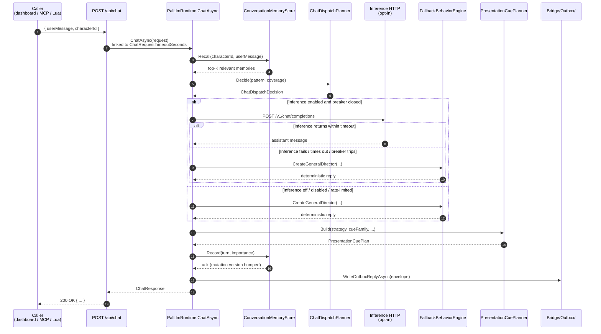
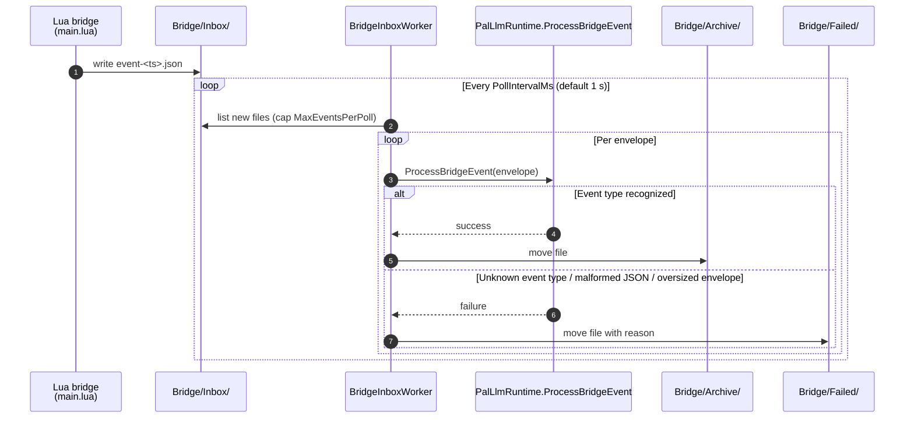
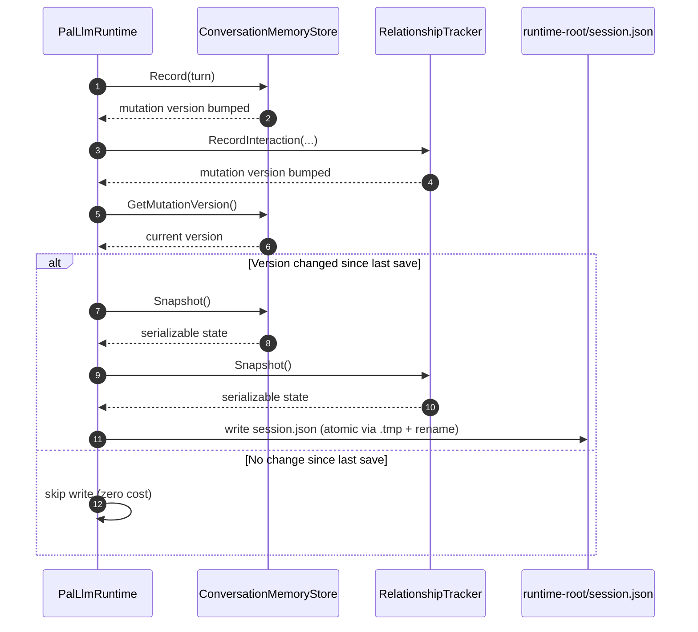
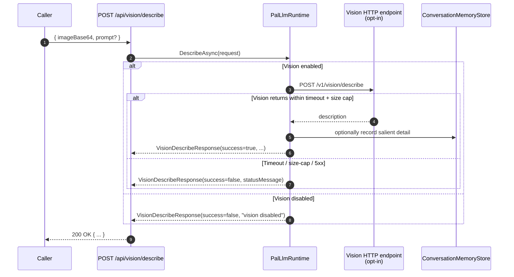
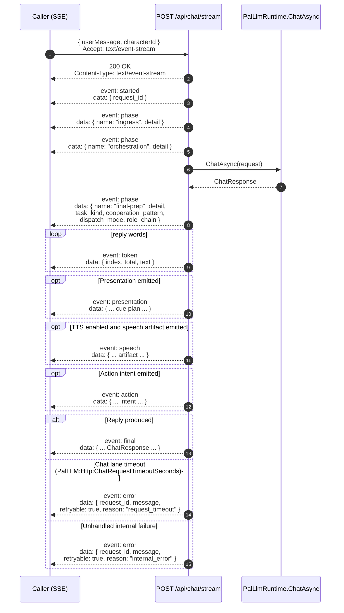

# Data flows — sequence diagrams

Last audited: `2026-05-21`

Mermaid sequence diagrams of the major runtime flows. Each one
names the actors, the order of calls, and the optional opt-in
branches. Read these before you refactor a flow — the visual
mental model maps directly to the code, and most "why does this
happen here?" questions are answered by tracing the diagram.

The system-level shell-and-arrow view lives in
[`ARCHITECTURE.md`](ARCHITECTURE.md) "System at a glance"; the
performance budgets live in [`HOT_PATH.md`](HOT_PATH.md); the
state machines for individual subsystems are in
[`STATE_MACHINES.md`](STATE_MACHINES.md).

## 1. Player chat → reply

The hot path. Triggered by `POST /api/chat` from a client (the
dashboard, the MCP server, or an external tool). Drained
`chat_message` envelopes enrich memory for later turns, but they
do not directly invoke `ChatAsync`.



Key invariants:

- The `Fallback` branch is **always reachable** (ADR 0001). If
  inference is off, breaker open, rate-limit hit, thermal
  gate, or model timeout, the runtime drops into Fallback
  without throwing.
- The `Outbox` write is **fire-and-forget advisory** (ADR
  0003). The HTTP response returns regardless of whether the
  Lua bridge picks up the envelope.
- The `PresentationCuePlan` is **always populated**. Every
  fallback strategy has a paired cue family.

Performance: see [`HOT_PATH.md`](HOT_PATH.md) — deterministic
path < 200 ms cold, with-inference < 2.5 s on a Standard tier.

## 2. Bridge inbox event → runtime

Periodic drain. The Lua bridge writes JSON envelopes to
`Bridge/Inbox/`; the sidecar's `BridgeInboxWorker` processes
them on the configured cadence.



Per-envelope budget is < 100 ms (see HOT_PATH §"Bridge"). At
the default poll interval and event cap, the worker can keep
up with sustained ~30 events/second. Each envelope is also
bounded by `PalLLM:Bridge:MaxInboxEventBytes` (default
`65536`) so the drain never deserializes arbitrarily large
local JSON files.

## 3. Memory persistence (autosave)

After every chat turn, the runtime checks whether memory state
changed and persists if so. Skipping the write when nothing
changed is the load-bearing optimization that keeps autosave
cost zero on idle turns.



The atomic-write pattern (write to `session.json.tmp`, rename
to `session.json`) prevents a torn-write window during sidecar
shutdown.

## 4. Vision describe (opt-in)

Triggered by `POST /api/vision/describe` or by the screenshot
watcher when `Vision:EnableScreenshotWatcher` is on.

When the watcher path is active, local image files are read through
`BoundedBase64FileReader` so the runtime stays on a sequential shared-read path
with pooled buffers instead of allocating a fresh `byte[]` per screenshot.



Like the chat path, vision **never throws** through the HTTP
layer. The `success=false` envelope carries the diagnostic.

## 5. Promotion ledger lifecycle (observe → suggest → apply)

The promotion pipeline is observation-only by default. A human
operator (or a deliberate API call) is required to take it
through to apply.

```mermaid
sequenceDiagram
    autonumber
    participant Runtime as PalLlmRuntime
    participant Feeder as PromotionLedgerFeeder
    participant Ledger as PromotionLedger
    participant Suggest as PromotionSuggestionBuilder
    participant Apply as PromotionApplier
    participant Staging as Runtime/PromotionStaging/
    participant Operator as Human operator

    Runtime->>Runtime: deterministic event (turn / fallback / breaker / tier transition)
    Runtime->>Feeder: observation
    Feeder->>Ledger: Record(observation)
    Ledger-->>Feeder: ack
    Note over Ledger: Bounded in-memory ring buffer; no I/O
    Operator->>Suggest: GET /api/promotion/suggestions
    Suggest->>Ledger: Read(top patterns)
    Ledger-->>Suggest: ranked list
    Suggest-->>Operator: PromotionSuggestion[]
    alt PromotionApply.AllowApply == true and operator opts in
        Operator->>Apply: POST /api/promotion/apply
        Apply->>Staging: write template / rollback / packet (NOT source code)
        Staging-->>Apply: paths
        Apply-->>Operator: PromotionApplyResult(staged)
        Operator->>Operator: review staged files, cherry-pick if accepted
    else AllowApply false (default)
        Operator->>Apply: POST /api/promotion/apply
        Apply-->>Operator: PromotionApplyResult(refused)
    end
```

The staged files are inspectable JSON / Markdown — no source
code is ever mutated by the runtime (ADR 0006 + ANTI_PATTERNS
"DON'T let promotion-apply mutate source code in-place").

## 6. Chat streaming (`/api/chat/stream`)

SSE channel that emits a fixed event vocabulary as the chat
orchestration progresses: `started` once, three `phase` events
(`ingress`, `orchestration`, `final-prep`), zero-or-more
`token` chunks, optional `presentation` / `speech` / `action`
side-channel payloads, and exactly one terminator — either
`final` (success) or `error` (timeout or internal failure).



The non-streaming `/api/chat` returns a single composed
response; the streaming variant emits the same content as
discrete events so a UE4SS consumer (or web client) can
render incrementally. The `phase: final-prep` event lands
immediately after orchestration completes and surfaces the
`task_kind`, `cooperation_pattern`, `dispatch_mode`, and
`role_chain` — clients can switch their renderer (fallback vs
live-inference badge, single- vs multi-model lane indicator)
before any tokens arrive. Because SSE headers are flushed
before the model lane finishes, `/api/chat/stream` reports a
chat-lane timeout as a sanitized `error` event and closes
without `final` instead of trying to rewrite the already-
started response into a late `503`.

## Related

- [`ARCHITECTURE.md`](ARCHITECTURE.md) "System at a glance"
  — the shell-and-arrow view
- [`STATE_MACHINES.md`](STATE_MACHINES.md) — per-subsystem
  state machines (breaker, bridge worker, promotion ledger)
- [`HOT_PATH.md`](HOT_PATH.md) — performance budgets per
  method named in these flows
- [`OBSERVABILITY.md`](OBSERVABILITY.md) — every span emitted
  during these flows, ready to view in Jaeger
