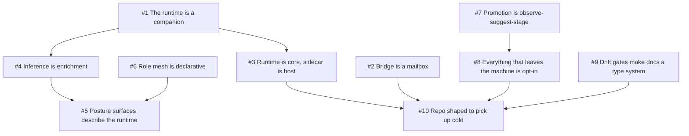

# Mental model — how to think about PalLLM

Last audited: `2026-05-22`

The five-minute version of "what is PalLLM, really?" for someone
who needs the right mental model fast — a returning contributor,
a new agent, a curious operator who's already past the
[`PITCH.md`](PITCH.md) elevator pitch and wants the conceptual
scaffolding before opening the code.

One short paragraph per concept, plus an analogy that tends to
make it click.

## 1. The runtime is a *companion*, not a chatbot

A chatbot fails by saying "I don't know" or returning HTTP 503
when its model is down. A companion fails by being absent —
which is unacceptable when the companion is supposed to be
*right there* with the player. PalLLM is shaped to never be
absent: every chat turn produces a working reply with or
without a live model, and that's the load-bearing decision the
rest of the design hangs from. **Analogy:** a tour guide who
keeps talking when the museum's audio guide cuts out, instead
of standing there silently.

See: [`adr/0001`](adr/0001-deterministic-first-reply-pipeline.md).

## 2. The bridge is a mailbox, not a phone

The sidecar and the game are two completely separate processes
in two completely different runtimes (`.NET 10` vs Lua 5.4
under UE4SS). They communicate through the filesystem:
inbound events go in `Bridge/Inbox/`, outbound replies in
`Bridge/Outbox/`. Neither side ever calls into the other's
process. **Analogy:** two neighbors leaving notes in each
other's mailboxes — independent crash domains, no co-deploy
risk, full audit trail by default. The cost is filesystem
latency (~10ms), which is fine for chat-rate (1Hz) traffic
and would be wrong for per-frame UI sync (a problem the Lua
side handles in-process via UE4SS APIs).

See: [`adr/0003`](adr/0003-one-way-advisory-bridge.md).

## 3. The runtime is the *core*; the sidecar is the *host*

`PalLLM.Domain` contains every interesting decision: chat
orchestration, fallback strategies, memory store, role mesh,
proof packets, advisors, builders. `PalLLM.Sidecar` is just
ASP.NET Core wiring that exposes the runtime over HTTP and
MCP. The runtime knows nothing about ASP.NET, Palworld, or
UE4SS — it talks to the host through five small interfaces in
`Portable/PortableAdapterContracts.cs`. **Analogy:** the
runtime is a kitchen; the sidecar is the dining room. A new
restaurant could serve the same kitchen through a different
dining room.

See: [`adr/0002`](adr/0002-portable-adapter-seam.md).

## 4. Inference is an *enrichment*, not a *prerequisite*

When someone says "I'm running PalLLM with no inference
endpoint," the right reply is "great, that's the supported
default." The deterministic fallback engine has 19 strategies
that pattern-match the player utterance and produce a
multi-sentence reply — no model needed. When inference is
enabled, the runtime tries it first and falls back if it
fails / times out / breaker-trips / rate-limits / thermal-gates.
The model adds *flavor*; the engine produces *substance*.
**Analogy:** a chef adding garnish — nice when present,
not the meal.

See: [`adr/0001`](adr/0001-deterministic-first-reply-pipeline.md),
[`docs/FALLBACK_AI_RESEARCH.md`](FALLBACK_AI_RESEARCH.md).

## 5. Posture surfaces describe the runtime to itself

Several builders compose deterministic snapshots of the
running system: `HardwareProfiler` (what's the box),
`PrivacyPostureBuilder` (what's currently emitting traffic),
`AirGapVerifier` (does any configured endpoint resolve to a
public IP), `ResourceBudgetPostureBuilder` (where in the
fallback-share envelope are we), `OperatorHealthScorer` (one
number 0-100 for "is this companion likely to give good
replies right now"). They feed `/api/health`,
`/api/describe`, `/api/privacy/posture`, `/api/budgets`,
`/api/airgap/verify`, the dashboard, and the MCP self-
description tools. **Analogy:** a car's dashboard is a
collection of these — speedometer, fuel gauge, engine-temp
gauge — each a small purpose-built instrument that reads the
same underlying state from a different angle.

See: [`docs/ADVISORS.md`](ADVISORS.md).

## 6. The role mesh is *declarative*, not *executive*

Operators bind named endpoints + models to the five mesh
roles (Edge / Worker / Judge / Media / Validator) via
`PalLLM:ModelRoles[]`. The runtime today still dispatches
through a single inference client — the role mesh is
*intent metadata* that surfaces in `/api/roles`, the
dispatch planner's decision, and the chat-turn span. Future
passes wire the planner's chain to actually hit those
endpoints; the metadata seam is in place. **Analogy:**
labelling spice jars before you've installed the spice
rack.

See: `src/PalLLM.Domain/Inference/ModelRoleRegistry.cs`,
`src/PalLLM.Domain/Inference/ChatDispatchPlanner.cs`.

## 7. The promotion pipeline is *observe → suggest → stage*, never *apply*

A feeder watches runtime events and records observations into
a bounded in-memory ledger. Operators (or AI agents calling
`GET /api/promotion/suggestions`) read the top patterns. If they
choose to "apply," the runtime writes a staging artifact
(template + rollback + audit packet) to
`Runtime/PromotionStaging/` — but it **never edits source
code in place**. A human reviewer cherry-picks. **Analogy:**
the runtime is a research assistant who marks up the page
with tracked changes, hands it back to the author, and waits
for explicit acceptance.

See: [`adr/0006`](adr/0006-opt-in-everything-by-default.md),
`src/PalLLM.Domain/Runtime/PromotionApplier.cs`.

## 8. Everything that can leave the machine is opt-in

By default a fresh PalLLM install emits zero outbound traffic.
Inference, vision, TTS, action intents, screenshot watcher,
thermal gate, API-key auth, OTLP export, MCP upstream
proxy — all default off. Each is a single config flag, and
the privacy posture builder reports them honestly. **Analogy:**
a brand-new phone with all data services disabled. The
operator turns on Wi-Fi when they're ready; nothing surprises
them.

See: [`adr/0006`](adr/0006-opt-in-everything-by-default.md),
[`docs/PRIVACY.md`](PRIVACY.md).

## 9. Drift gates make documentation a *type system*

Counts in docs (test count, route count, feature count,
hot-file line counts) are mechanically verified to match the
underlying code. If you add a route and forget to bump README,
CI fails — the same way a missing semicolon would fail. The
gates are in `scripts/run_full_audit.ps1`; there are 16 of
them now (Pass 311 added `Drift_Hot_file_line_count` after the
operator's `PalLlmRuntime.cs` size silently aged 700 lines past
its prose mirror). The mental shift: documentation isn't
*prose that drifts from reality*, it's *a contract enforced by
the build*. **Analogy:** the audit is to docs what the type
system is to code.

See: [`adr/0004`](adr/0004-drift-gates-over-manual-review.md),
[`docs/QUICKREF.md`](QUICKREF.md) "Drift gates" section.

## 10. The repo is shaped to be *picked up cold*

Every load-bearing decision has an ADR
([`docs/adr/`](adr/)). Every common task has a recipe
([`docs/COOKBOOK.md`](COOKBOOK.md)). Every extension point
has a "where does this go?" entry
([`docs/EXTENSION_POINTS.md`](EXTENSION_POINTS.md)). Every
flow has a sequence diagram
([`docs/DATAFLOW.md`](DATAFLOW.md)). Every state machine has
a state diagram
([`docs/STATE_MACHINES.md`](STATE_MACHINES.md)). The audit
runs in seconds, the test suite runs in 30 s, the
`pal.ps1 onboard` flow takes 90 s end-to-end. **Analogy:**
the repo is a movie set with the lights still on after the
crew leaves — anyone walking in can find the props, the
script, and the call sheet without asking.

## How the concepts connect

## Where to go from here

Once these ten ideas feel familiar:

- **For "I want to add code":**
  [`COOKBOOK.md`](COOKBOOK.md) +
  [`EXTENSION_POINTS.md`](EXTENSION_POINTS.md)
- **For "I want to understand the architecture":**
  [`ARCHITECTURE.md`](ARCHITECTURE.md) +
  [`DATAFLOW.md`](DATAFLOW.md)
- **For "I want to debug something":**
  [`OBSERVABILITY.md`](OBSERVABILITY.md) +
  [`RUNBOOK.md`](RUNBOOK.md) +
  [`STATE_MACHINES.md`](STATE_MACHINES.md)
- **For "I want to lift a piece into another project":**
  [`HARVEST.md`](HARVEST.md) +
  [`adr/0002`](adr/0002-portable-adapter-seam.md)
