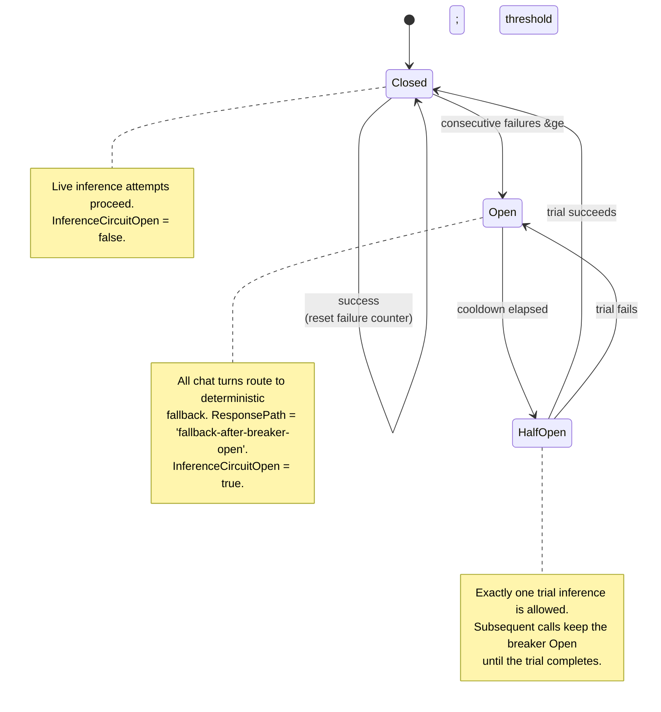
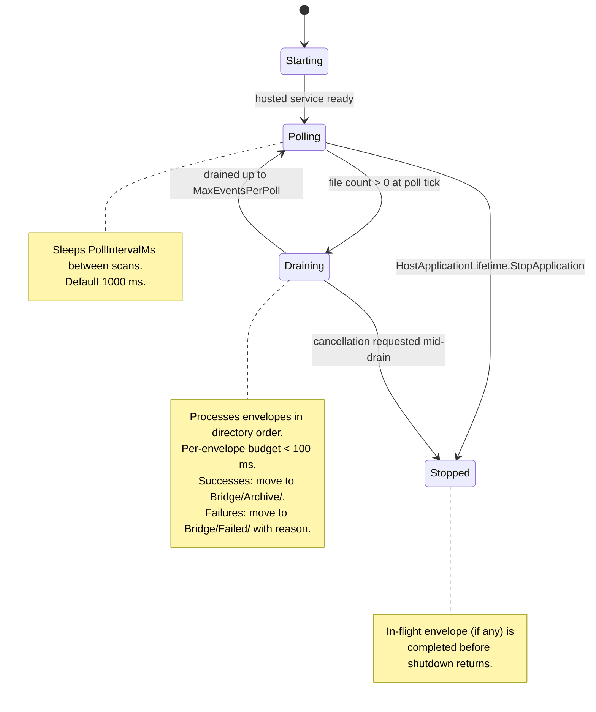
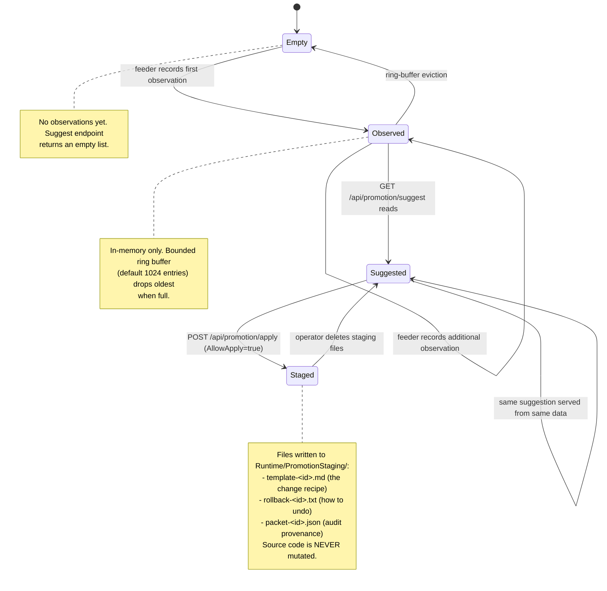
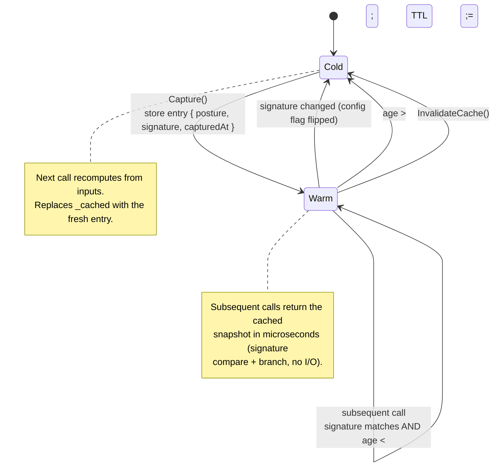
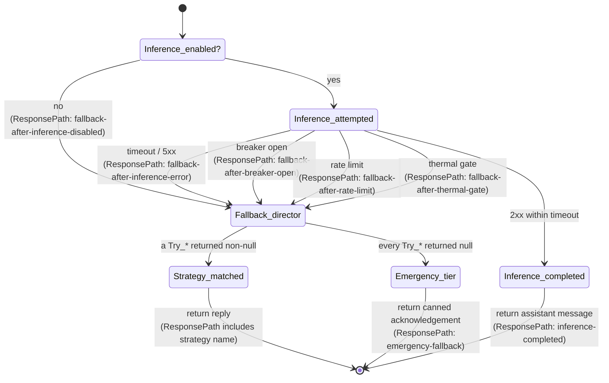

# State machines

Last audited: `2026-05-07`

Mermaid `stateDiagram-v2` views of the explicit state machines
inside PalLLM. Each diagram is the canonical mental model — the
code aligns with these states and transitions. If the code drifts
from the diagram, **fix the code** (or, if the diagram is wrong,
fix the diagram in the same PR).

## 1. Inference circuit breaker

Protects the chat hot path from a flaky inference endpoint.
Counts consecutive failures; trips when the threshold breaches;
half-opens after a cooldown to test recovery; closes on the
first successful trial.

**Source of truth**: `src/PalLLM.Domain/Inference/InferenceClient.cs`
(circuit-breaker logic). The threshold and cooldown are
configurable via
`Inference:CircuitBreakerFailureThreshold` and
`Inference:CircuitBreakerCooldownSeconds`.

**Observability**: every transition emits a structured log line
and a tag on the next `Chat.Inference` span. The breaker's
current state is reported in `RuntimeHealth.InferenceCircuitOpen`
and the dashboard's circuit-breaker chip.

**Recovery without restart**: send a single chat through with
`force_inference: true` after the cooldown — if the underlying
endpoint is healthy, the trial succeeds and the breaker closes.

## 2. Bridge inbox worker

Background `IHostedService` that drains `Bridge/Inbox/`. Stays
in `Polling` while the sidecar is up; transitions to `Draining`
when files are present; back to `Polling` when the directory is
empty again. `Stopped` only on host shutdown.

**Source of truth**: `src/PalLLM.Sidecar/BridgeInboxWorker.cs`.

## 3. Promotion ledger lifecycle

A bounded in-memory ring buffer of observations. Each entry has
a class (`task class` like `fallback-director`, `live-inference`)
and a pattern id. Suggestions read the top-N entries; apply
optionally promotes one to staging artifacts.

**Source of truth**: `src/PalLLM.Domain/Runtime/PromotionLedger.cs`,
`PromotionLedgerFeeder.cs`, `PromotionApplier.cs`.

## 4. TTL cache (posture surfaces)

The pattern from ADR 0005, abstracted. Every `*Cached` builder
has the same shape.

**Source of truth**: every `*Cached` method follows this shape.
The cleanest reference implementation is
`src/PalLLM.Sidecar/AirGapVerifier.cs` (`VerifyCached`).

## 5. Chat reply path (which strategy fires?)

Not a true state machine — more a deterministic decision tree.
Documenting it here because the choice tree is what produces the
`ResponsePath` value on every `ChatResponse`.

**Source of truth**: `src/PalLLM.Domain/Runtime/PalLlmRuntime.cs`
(`ChatAsync`).

The `ResponsePath` value is the single most useful diagnostic in
the runtime. Every reason a chat could land somewhere unexpected
shows up there.

## Related

- [`DATAFLOW.md`](DATAFLOW.md) — sequence diagrams for the
  flows these state machines participate in
- [`OBSERVABILITY.md`](OBSERVABILITY.md) — every state
  transition above is observable as a tagged span
- [`HOT_PATH.md`](HOT_PATH.md) — the latency budgets the
  states must hit
- [`adr/0005-ttl-cache-for-posture-surfaces.md`](adr/0005-ttl-cache-for-posture-surfaces.md)
  — the cache state machine's ADR
- [`RUNBOOK.md`](RUNBOOK.md) — what to do when you observe an
  unexpected transition
